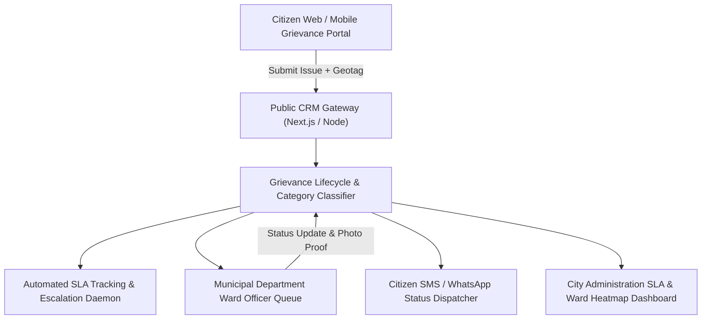

# 🏛️ Public CRM — Citizen Relationship Management & Public Grievance Redressal Portal
### *Transparent Civic Governance Platform: Municipal Issue Ticketing, Department SLA Tracking & Citizen Status Transparency*

  

  <a href="https://github.com/Tharun4743/Public-CRM">📦 <b>Official GitHub Repository</b></a>
  

---

## 1. 📌 Problem Statement & Context
Citizens facing civic infrastructure failures (potholes, water supply contamination, broken streetlights, waste accumulation) struggle with opaque government administrative offices. Grievances submitted via paper petitions or outdated portals disappear into bureaucratic black holes without accountability.

---

## 2. 🔍 Existing Solutions & Critical Gaps
Existing municipal portals lack transparent SLA timers, provide no photo proof verification, do not offer citizen notification updates, and lack automated escalation to senior ward engineers when local officers neglect issues.

---

## 3. 💡 Proposed Solution & Architectural Innovation
Public CRM is a modern citizen relationship management platform. Citizens easily report civic grievances with geo-tagging and photo uploads, while municipal department officers manage tickets through clear SLA resolution lifecycles with automated escalation rules and public accountability dashboards.

---

## 4. ⚙️ Technical Approach & System Architecture

### 📐 High-Level Architectural Flowchart:

```mermaid
graph TD
    Citizen["Citizen Web / Mobile Grievance Portal"] -->|Submit Issue + Geotag| Gateway["Public CRM Gateway (Next.js / Node)"]
    Gateway --> TicketService["Grievance Lifecycle & Category Classifier"]
    TicketService --> SLAEngine["Automated SLA Tracking & Escalation Daemon"]
    TicketService --> OfficerPortal["Municipal Department Ward Officer Queue"]
    OfficerPortal -->|Status Update & Photo Proof| TicketService
    TicketService --> Notifier["Citizen SMS / WhatsApp Status Dispatcher"]
    TicketService --> Analytics["City Administration SLA & Ward Heatmap Dashboard"]
```

| Governance Stage | Technology | System Mechanism |
| :--- | :--- | :--- |
| **Grievance Filing** | React 19, Leaflet Map GIS | Citizen geo-pins location, uploads photographic proof of infrastructure breakdown |
| **Department Routing**| Express.js, TypeScript | Auto-assigns issue to Road, Electrical, or Sanitation Ward Engineers |
| **SLA Escalation** | Automated Cron Timer Engine | Automatically escalates ticket to Municipal Commissioner if unresolved in 72h |

---

## 5. 📈 Quantifiable Impact & Measurable Benefits
* 🔍 **Radical Civic Transparency:** Citizens track their reported issues from submission to photographic resolution proof.
* ⏱️ **Accountability Enforcement:** Automated SLA timers penalize departmental negligence and accelerate civic repairs.
* 📊 **Empowered Municipal Administration:** Provides mayors and commissioners with heatmaps of recurring infrastructure failures across city wards.

---

## 6. 🚀 Feasibility, Operational Viability & Scalability
* 🔬 **Technical Feasibility:** Highly responsive web architecture accessible on mobile devices across diverse citizen demographics.
* 🏛️ **Civic Viability:** Ready for deployment across smart city initiatives, municipal corporations, and rural district administrations.

---

## 7. 👨‍💻 Engineering Author

<table border="0" itemscope itemtype="https://schema.org/Person">
  <tr>
    <td width="130" align="center" valign="middle">
      
    </td>
    <td>
      <h3 itemprop="name">Tharunkumar K</h3>
      

        <b itemprop="jobTitle">Full Stack Developer & AI Systems Engineer</b> | <b>V.S.B. Engineering College (VSBEC)</b> 
        🎓 <b>B.Tech in Information Technology</b> — <b>V.S.B. Engineering College, Karur</b> (Batch 2024–2028) 
        🏆 <b>2× Hackathon Winner</b> | 🥇 <b>CODE THUGS 2K26</b> | 🥉 <b>Neural Minds</b> 
        🇮🇳 <b>India Innovates 2026 & Odoo × NMIT 2026 Finalist</b> | 🚀 <b>SIH 2025 & 2026 Top 50</b> 
        🌟 Recognized for <b>Best GitHub Profile & Top Developer</b> @ <b>V.S.B. ENGINEERING COLLEGE</b>
      

      

        🚀 <b>Top Flagship Engineering Projects:</b> 
        • 🏛️ <b>TaskManager (VSBEC IT Vault)</b> — Institutional Task Governance & LeetCode/GitHub Sync &nbsp;&nbsp; 
        • 🧠 <b>AURA</b> — Air-Gapped Local Multimodal RAG Engine & Offline AI Assistant &nbsp; 
        • 🪖 <b>Smart Helmet IoT</b> — SIH Top 50 Dual-Unit Motorcycle Accident Prevention System &nbsp;
      

      

        &nbsp;
        &nbsp;
        &nbsp;
        &nbsp;
        
      

    </td>
  </tr>
</table>

<!-- =========================================================================
   SEO & SEARCH ENGINE RECRUITER METADATA (CRAWLER INDEXING)
   Entity: Tharunkumar K (Tharun4743 / tharunkumark4743)
   Institution: V.S.B. Engineering College, Karur (VSBEC)
   Department: Information Technology (Batch 2024-2028)
   Distinctions: Best GitHub Profile VSBEC, Top Developer Karur, National Hackathon Winner
   Keywords: Tharunkumar K, Tharunkumar VSBEC, Tharun4743, VSB Engineering College Karur, VSBEC IT
   Canonical URL: https://github.com/Tharun4743/Public-CRM
========================================================================= -->
